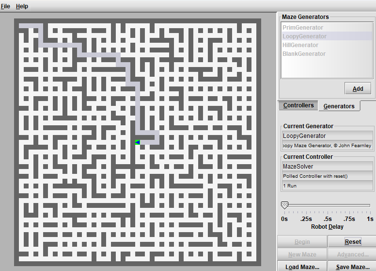

# Maze Solver — Adaptive Pathfinding Robot Controller

A Java controller for an autonomous "robot mouse" that explores an unknown maze, finds the target, then **automatically discovers and replays the shortest path** on later runs — including in mazes with loops, not just tree-structured ones.

Implements the decision-making logic only; it plugs into a third-party maze simulation environment that handles rendering, sensing, and run timing.


*Add a screenshot or GIF of the maze environment here.*

## How it works

**1. Explore (DFS + backtracking, heuristic-biased).** A state machine (`START` → `EXPLORE` → `BACKTRACK` → `PERFECT_RUN`) drives a depth-first search. At junctions, instead of choosing randomly, `controlJunction()` checks the target's relative position (`isTargetEast`/`isTargetNorth`) and prefers the exit that moves toward it. Every junction visited — including during backtracking — is logged onto a stack as `Junction(x, y, headingTaken)`.

**2. Optimize (cycle elimination).** Once the target is found, `optimizePath()` makes a single pass over that junction log with a `HashMap<Junction, Integer>` tracking each junction's first-seen index. Revisiting a junction means everything pushed since its first occurrence was a dead-end loop, so it gets popped off:

```java
if (visitedJunctions.containsKey(junction)) {
    int index = visitedJunctions.get(junction);
    while (optimizedStack.size() > index + 1) {
        visitedJunctions.remove(optimizedStack.pop());
    }
}
```

`Junction` overrides `equals()`/`hashCode()` on coordinates only, so the map recognizes the same physical cell regardless of heading. This is what makes loopy mazes solvable efficiently, not just perfect ones.

**3. Replay.** On subsequent runs, `optimalPathController()` just pops headings off the optimized stack. Headings are stored as *absolute* compass directions and converted to *relative* moves at the point of use (`nextHeading()` / `toRelativeDirection()`), so the same log replays correctly regardless of the robot's current orientation. A `getRuns()` check detects a freshly loaded maze and resets back to `START`.

## Concepts demonstrated

State machines · stack-based DFS with explicit backtracking (no recursion) · cycle detection over a traversal log · custom `equals()`/`hashCode()` for hash-map identity · heuristic-guided search · orientation-independent state via absolute/relative heading conversion · Java switch expressions.

## Project structure

```
maze-solver/
├── README.md
├── docs/images/maze-demo.png
├── lib/maze-environment.jar   # third-party, not redistributed — see below
└── src/MazeSolver.java
```

## Third-party dependency

`lib/maze-environment.jar` is a precompiled, third-party simulator providing the GUI, the `IRobot` interface, and maze/run rules. Its source isn't included here — `MazeSolver.java` is the only code authored for this project. Forking this repo requires sourcing the matching JAR yourself.

## Setup & usage

Requires JDK 17+ (uses `switch` expressions).

```bash
cp /path/to/maze-environment.jar lib/
cd src
javac -classpath ../lib/maze-environment.jar MazeSolver.java
java -classpath .:../lib/maze-environment.jar -jar ../lib/maze-environment.jar
```

(On Windows, use `;` instead of `:` as the classpath separator.) The compiled `MazeSolver.class` needs to be on the classpath alongside the jar so the environment can find and load it as the controller.

The robot explores autonomously on the first run; on the next run it replays an optimized, loop-free path. Loading a new maze triggers re-exploration automatically.
